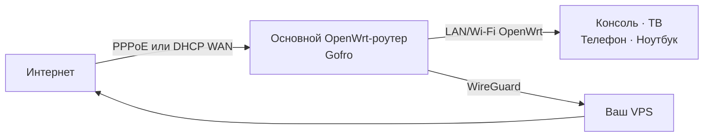

<p align="center">
  
</p>

<p align="center">
  <strong>Превратите роутер с OpenWrt в сеть с VPN.</strong><br>
  Подключайте телевизор, консоль, телефон или ноутбук без VPN-приложений на каждом устройстве.
</p>

<p align="center">
  
  
  
  
</p>

## VPN на OpenWrt

**Gofro Router** добавляет VPN на основной роутер с OpenWrt 25.12;
отдельный роутер за домашним DHCP-uplink тоже подходит. OpenWrt продолжает
управлять PPPoE/DHCP, учётными данными, MTU, LAN, DHCP, Wi-Fi и LuCI.
Gofro не создаёт отдельную Wi-Fi-сеть и не меняет эти настройки.

Здесь описана ещё не выпущенная VPN-only интеграция на базе v0.5.15.
Версия workspace остаётся `0.5.15`; ссылки установки ведут на опубликованный
релиз, а не на текущие изменения исходников.

## Платформа

Gofro не привязан к производителю или модели: установщик выбирает
статический бинарник по ABI устройства. Поддерживаемые ABI и требования
перечислены в [инструкции OpenWrt](deploy/openwrt/README.md). Собственных образов
прошивки здесь нет.

Установщик добавляет:

- `gofro-agent` - локальный контроллер и web-панель;
- `gofro-relay` - обфусцированный UDP-транспорт для WireGuard;
- сервисы `procd`;
- GeoSite/GeoIP данные для раздельной маршрутизации.

Rust workspace разделён по runtime-ролям:

- `gofro-agent` управляет API, FakeDNS и маршрутизацией;
- `gofro-server` добавляет и удаляет WireGuard peers на VPS;
- `wireguard-status` читает и разбирает `wg show ... dump`;
- `gofro-relay` передаёт WireGuard-пакеты между роутером и VPS.

## Установка

Настройте LAN, WAN, DHCP, Wi-Fi, регион и LuCI в OpenWrt до установки.
Отключите software и hardware flow offloading сами: helper откажет при
включённом offloading, но не изменит его. Требуется проверенный логический
`lan` в собственной эксклюзивной firewall-зоне; имя зоны может быть не `lan`.
Затем на свежем
совместимом роутере с OpenWrt 25.12 выполните:

```sh
tmp="$(mktemp)" && trap 'rm -f "$tmp"' EXIT && uclient-fetch -q -O "$tmp" https://github.com/gofronet/gofro-router/releases/latest/download/gofro-install && sh "$tmp" --install
```

После установки консоль выводит одноразовый код и 15-минутное окно настройки.
Первый пользователь с кодом создаёт администратора и настраивает только VPN через
импорт профиля или VPS. Сеть не меняется. Подробности: [OpenWrt](deploy/openwrt/README.md).

## Схема сети



1. OpenWrt получает uplink по DHCP или PPPoE.
2. OpenWrt управляет LAN, DHCP, Wi-Fi и LuCI; Gofro не меняет подсеть LAN.
3. FakeDNS и nftables выбирают прямой маршрут, VPN или блокировку.
4. WireGuard передаёт VPN-трафик через ваш VPS.

DNS TCP/UDP обеих IP-семей перенаправляется с LAN:53 на 5353; сокеты
ограничены LAN-устройством через `SO_BINDTODEVICE` и делегируют разрешение
нативному dnsmasq на LAN IPv4:53.

## Управление

Панель Gofro доступна по `https://<LAN-адрес>:8443`; `http://<LAN-адрес>:8081`
перенаправляет на неё. LuCI сохраняет свои обычные `80` и `443`. Например,
`192.168.0.1` задаётся в OpenWrt до установки, а не установщиком Gofro.

В панели можно:

- включать и отключать VPN, выбирать режим **По правилам** или **Весь интернет**;
- добавлять и выбирать VPN-серверы;
- управлять своим VPS и именными доступами друзей: создавать, переименовывать,
  скачивать `wg.conf` повторно и отзывать доступ;
- задавать правила GeoSite, GeoIP, доменов и подсетей в общем списке: первое
  подходящее правило выбирает VPN, прямой маршрут или блокировку;
- видеть состояние туннеля;
- выбирать светлую, тёмную или системную тему, обновлять и перезагружать роутер.

Режим **Весь интернет** отправляет публичный трафик через VPN, сохраняя правила
для возврата в режим **По правилам**. Локальные адреса доступны напрямую.
В разделе **Остальные сайты** задаётся маршрут для трафика без совпадения.
Проверка домена предварительная: IP-зависимые правила учитываются после DNS.
Перезагрузка недоступна во время обновления и не удаляет настройки.

Если VPN пропадает, таблица маршрутизации остаётся fail-closed и не отправляет
помеченный VPN-трафик через обычный WAN.

Boot guard (`START=18`) использует сохранённый root-owned
`/etc/gofro/guard-device` и блокирует forwarding до запуска WAN и полного
reconcile совместимым агентом. Остановка агента сохраняет блокировку и
возвращает нативный DNS сразу только для новых потоков; старые NAT-потоки
могут ждать истечения conntrack. Перенумерация адреса на том же LAN-устройстве
поддерживается. Смена LAN-устройства/зоны, `fw4 stop` и flush всего ruleset
требуют согласованного обслуживания; обычный fw4 reload сохраняет таблицы Gofro.
Подробные ограничения и миграция только подтверждённого состояния v0.5.15:
[OpenWrt](deploy/openwrt/README.md#guard-and-maintenance).

Нажмите название сервера в разделе **VPN → Серверы**, чтобы открыть управление.
Проверка доступности, обновление и перезапуск VPN доступны только для своего
VPS, добавленного через SSH. Перезапуск VPN временно прерывает подключения
владельца и друзей; отзыв одного друга не затрагивает пир роутера и других друзей.

Имена и ключи новых доступов хранятся на VPS в
`/etc/gofro/friends/<interface>.json` с правами `0600` в каталоге `0700`.
Списки доступа не содержат приватных ключей; конфигурация запрашивается отдельно
при нажатии **Поделиться**. Старые пиры можно переименовать и отозвать, но повторно
скачать их конфигурацию нельзя, если приватный ключ не был сохранён при создании.
Для новых команд управления нужно обновить серверный пакет Gofro на VPS;
старая версия покажет сообщение о необходимости обновления.

## `gofro-relay`

WireGuard шифрует трафик, но его UDP-пакеты имеют узнаваемую структуру.
`gofro-relay` меняет внешнюю форму уже зашифрованных пакетов:

```text
WireGuard на Gofro Router
    -> локальный gofro-relay
    -> UDP-порт 8443 на VPS
    -> серверный gofro-relay
    -> WireGuard на VPS
```

Relay не расшифровывает пользовательский трафик и не заменяет безопасность
WireGuard. Это транспортная обфускация против базового распознавания протокола,
а не дополнительное шифрование или имитация HTTPS.

## Что понадобится

- совместимый роутер с официальным OpenWrt 25.12;
- заранее настроенное подключение WAN: DHCP или PPPoE;
- VPS с публичным IPv4;

## Обновления

Gofro автоматически проверяет GitHub каждые шесть часов. Для немедленной
проверки откройте раздел **Панель** и нажмите **Проверить
обновления**. Updater проверяет подписанный release-архив, атомарно переключает
версию и возвращает предыдущую при неудачном health check или прерванном
обновлении. Конфигурация в `/etc/gofro` и OpenWrt UCI не перезаписывается.

После неудачного guarded rollback на v0.5.15 управление может восстановиться,
но forwarding остаётся заблокированным до полного reconcile совместимым
агентом. Новый агент возвращает HTTP `503` при degraded health; доступная
панель не означает здоровый dataplane. Финализация не снимает guard ради успеха.

Процедура выпуска описана в [RELEASING.md](RELEASING.md).
