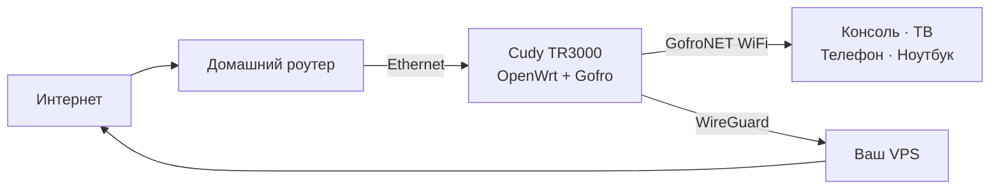

<p align="center">
  
</p>

<p align="center">
  <strong>Превратите OpenWrt-роутер в отдельную Wi-Fi-сеть с VPN.</strong><br>
  Подключайте телевизор, консоль, телефон или ноутбук без VPN-приложений на каждом устройстве.
</p>

<p align="center">
  
  
  
  
</p>

## Отдельный Wi-Fi с VPN

**Gofro Router** работает на отдельном OpenWrt-роутере. Он получает интернет от
основного домашнего роутера по Ethernet и создаёт сеть `GofroNET WiFi`. Для
консоли, телевизора или телефона это обычный Wi-Fi; маршрутизация через VPS
выполняется на роутере.

Основная домашняя сеть не меняется. Если Gofro выключен, остальные домашние
устройства продолжают работать через основной роутер.

## Платформа

Текущий target - Cudy TR3000-256MB V1.0 с официальным OpenWrt 25.12. Ядро,
драйверы, Wi-Fi, NAND, firewall и обновление системы предоставляет OpenWrt.
Репозиторий собирает только статические бинарники и установочный архив Gofro;
собственной ОС и образов прошивки здесь больше нет.

Установщик добавляет:

- `gofro-agent` - локальный контроллер и web-панель;
- `gofro-relay` - обфусцированный UDP-транспорт для WireGuard;
- `procd`-сервисы и UCI-конфигурацию;
- GeoSite/GeoIP данные для раздельной маршрутизации.

Rust workspace разделён по runtime-ролям:

- `gofro-agent` управляет OpenWrt, API, FakeDNS и маршрутизацией;
- `gofro-server` добавляет и удаляет WireGuard peers на VPS;
- `wireguard-status` читает и разбирает `wg show ... dump`;
- `gofro-relay` передаёт WireGuard-пакеты между роутером и VPS.

## Установка

На свежем поддерживаемом OpenWrt замените `RU` на двухбуквенный код своей
страны и выполните одну команду:

```sh
tmp="$(mktemp)" && trap 'rm -f "$tmp"' EXIT && uclient-fetch -q -O "$tmp" https://github.com/gofronet/gofro-router/releases/latest/download/gofro-install && sh "$tmp" --install RU
```

Установщик скачает подписанный релиз, проверит его и настроит Gofro. После
установки подключитесь к `GofroNET WiFi` и откройте
[gofrowifi.net:8080](http://gofrowifi.net:8080). Подробности и настройка VPS
описаны в [deploy/openwrt/README.md](deploy/openwrt/README.md).

## Схема сети



1. OpenWrt получает uplink по WAN.
2. Gofro настраивает LAN `10.203.1.1/24` и отдельный Wi-Fi.
3. FakeDNS и nftables выбирают прямой маршрут, VPN или блокировку.
4. WireGuard передаёт VPN-трафик через ваш VPS.

## Управление

Панель Gofro доступна по адресу
[gofrowifi.net:8080](http://gofrowifi.net:8080). LuCI остаётся на стандартном
порту 80 по адресу [10.203.1.1](http://10.203.1.1).

В панели можно:

- переключаться между режимами **VPN** и **DIRECT**;
- добавлять и выбирать VPN-серверы;
- задавать правила GeoSite, GeoIP, доменов и подсетей;
- видеть состояние туннеля и подключённые Wi-Fi-устройства;
- менять имя и пароль Wi-Fi-сети.

Если VPN пропадает, таблица маршрутизации остаётся fail-closed и не отправляет
помеченный VPN-трафик через обычный WAN.

## `gofro-relay`

WireGuard шифрует трафик, но его UDP-пакеты имеют узнаваемую структуру.
`gofro-relay` меняет внешнюю форму уже зашифрованных пакетов:

```text
WireGuard на OpenWrt
    -> локальный gofro-relay
    -> UDP-порт 8443 на VPS
    -> серверный gofro-relay
    -> WireGuard на VPS
```

Relay не расшифровывает пользовательский трафик и не заменяет безопасность
WireGuard. Это транспортная обфускация против базового распознавания протокола,
а не дополнительное шифрование или имитация HTTPS.

## Что понадобится

- Cudy TR3000-256MB V1.0 с совместимым OpenWrt 25.12;
- Ethernet-подключение к основному роутеру;
- VPS с публичным IPv4;
- release-архив `gofro-router-aarch64-openwrt-linux-musl.tar.gz`.

Для устройств с серийным кодом `2544` и новее нельзя использовать старый Cudy
intermediate image: их NAND требует поддержки `F50L1G41LC`.

## Обновления

Gofro автоматически проверяет GitHub каждые шесть часов. Команда
`gofro-update` запускает проверку немедленно. Updater проверяет подписанный
release-архив, атомарно переключает версию и возвращает предыдущую при неудачном
health check или прерванном обновлении. Конфигурация в `/etc/config/gofro` и
`/etc/gofro` при обновлении не перезаписывается.

Процедура выпуска описана в [RELEASING.md](RELEASING.md).

Версия 0.4 требует новой установки на поддерживаемый OpenWrt-роутер.
