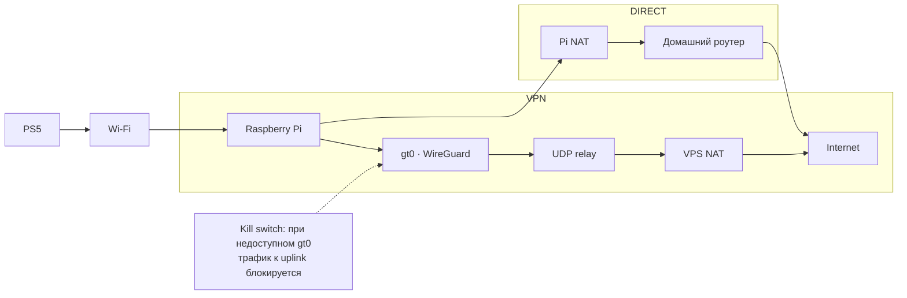
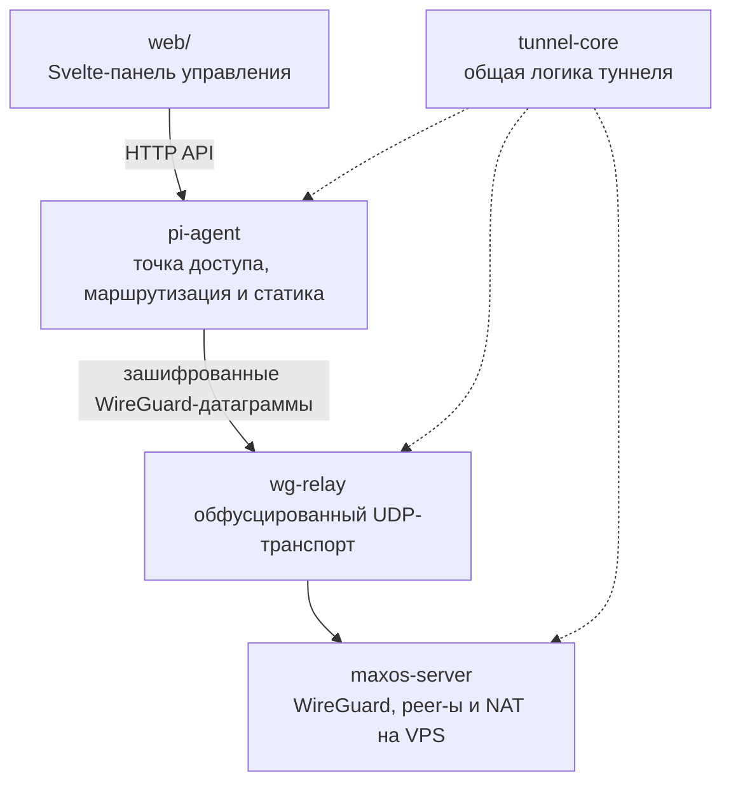

<p align="center">
  
</p>

<p align="center">
  Превращает Raspberry Pi 5 в отдельную Wi‑Fi-сеть для PS5: защищённый маршрут через WireGuard и VPS или прямой доступ в интернет — с управлением из локальной web-панели.
</p>

<p align="center">
  
  
  
  
  
</p>

## Что это

**GofroWiFi** — набор сервисов для Raspberry Pi и VPS, который создаёт отдельную Wi‑Fi-сеть для игровой консоли. Pi поднимает точку доступа, локальный агент обслуживает панель управления, а трафик направляется либо через зашифрованный WireGuard-туннель и UDP-relay, либо напрямую через NAT.

В web-панели можно:

- видеть состояние туннеля, активный маршрут и трафик;
- наблюдать CPU, память, температуру, uptime и подключённые Wi‑Fi-устройства;
- добавлять, изменять, выбирать и удалять VPN-профили;
- явно переключаться между режимами **VPN** и **DIRECT**;
- менять SSID и пароль точки доступа.

## Как работает



| Режим | Маршрут | Назначение |
| --- | --- | --- |
| **VPN** | `wlan0 → gt0 → relay → VPS NAT` | Трафик идёт через VPS; kill switch сохраняется |
| **DIRECT** | `wlan0 → Pi NAT → eth0 → домашний роутер` | Явный обход туннеля для прямого доступа |

## Компоненты



| Компонент | Ответственность |
| --- | --- |
| `pi-agent` | API устройства, управление точкой доступа и локальная раздача web-интерфейса |
| `wg-relay` | Передача уже зашифрованных WireGuard-датаграмм через UDP |
| `maxos-server` | Управление peer-ами WireGuard, настройка VPS и NAT |
| `tunnel-core` | Общая логика команд и конфигурации туннеля |
| `web/` | Svelte 5 SPA для состояния, профилей VPN и параметров Wi‑Fi |

## Быстрый старт

### Требования

- Raspberry Pi 5 с Raspberry Pi OS Lite 64-bit и Ethernet-подключением к домашнему роутеру;
- VPS на Ubuntu или Debian с публичным IPv4;
- Rust 1.85+ для сборки сервисов;
- Bun 1.3.14 для воспроизводимой сборки web-интерфейса;
- открытый UDP-порт `8443` на VPS и его firewall.

### Сборка

Сначала соберите web-интерфейс: `pi-agent` встраивает получившиеся assets.

```bash
(cd web && bun install --frozen-lockfile && bun run build)
cargo build --workspace --release
```

## Развёртывание

### 1. VPS

В корне репозитория на VPS:

```bash
cargo build --release -p maxos-server -p wg-relay
sudo ./deploy/server/install.sh
```

Скрипт выводит публичный ключ сервера, включает IPv4 forwarding, настраивает NAT для `10.203.0.0/16` и запускает WireGuard с relay. Один relay принимает до 256 клиентов на общем публичном порту и удаляет неактивные сессии через три минуты.

При необходимости укажите интерфейс и порты явно:

```bash
sudo WAN_INTERFACE=ens3 WG_PORT=51820 RELAY_PORT=8443 ./deploy/server/install.sh
```

### 2. Raspberry Pi

Перед установкой Pi должна использовать Ethernet как uplink: установщик остановится, если активным uplink остаётся `wlan0`.

```bash
cargo build --release -p pi-agent -p wg-relay -p gofro-updater
sudo \
  SERVER_PUBLIC_KEY="SERVER_PUBLIC_KEY" \
  SERVER_ENDPOINT="VPS_IP:8443" \
  AP_PASSWORD="choose-a-password" \
  WIFI_COUNTRY="DE" \
  ./deploy/pi/install.sh
```

Доступные настройки:

```text
AP_SSID="GofroNET WiFi"
AP_CHANNEL=36
WG_ADDRESS=10.202.0.2/32
GAME_SUBNET=10.203.1.0/24
GAME_GATEWAY=10.203.1.1/24
```

Установщик напечатает публичный ключ Pi и команду для добавления peer на VPS.

### 3. Добавьте Pi на VPS

Выполните команду, которую вывел Pi-установщик:

```bash
sudo maxos-server add-peer \
  --public-key "CLIENT_PUBLIC_KEY" \
  --tunnel-ip "10.202.0.2/32" \
  --subnet "10.203.1.0/24"
```

Проверить peer-ы:

```bash
sudo maxos-server status
```

### 4. Подключитесь

Подключите телефон к `GofroNET WiFi` и откройте [http://gofrowifi.net](http://gofrowifi.net). Затем подключите PS5 к той же сети.

## Проверка и диагностика

Полный набор проверок разработки:

```bash
cargo fmt --check
cargo test --workspace
cargo clippy --workspace --all-targets -- -D warnings
bash -c 'cd web && bun run check && bun run build'
bash -n deploy/pi/*.sh
bash -n deploy/server/install.sh
```

Полезные команды на Pi:

```bash
sudo wg show
systemctl status maxos-wg-relay-client
ip rule
ip route show table 100
sudo nft list table inet maxos_pi
```

На VPS:

```bash
sudo wg show
systemctl status maxos-wg-relay-server
sudo nft list table inet maxos_server
```

## Автоматические обновления

Pi проверяет подписанные стабильные GitHub releases каждые шесть часов. Обновление
атомарно переключает все бинарные файлы и откатывается при ошибке сервисов, API
или ранее работавшего VPN. На странице Wi-Fi обновление также можно проверить и
установить вручную с отображением прогресса. Процедуры выпуска, миграции и
восстановления описаны в [RELEASING.md](RELEASING.md).

## Ограничения

- Система рассчитана на доверенную локальную сеть: авторизация в web-клиенте пока отсутствует.
- API web-панели доступно по относительному префиксу `/api`.
- VPN-профиль требует relay endpoint и публичный ключ WireGuard; перед его выбором серверные компоненты и peer Pi должны быть настроены на VPS.
