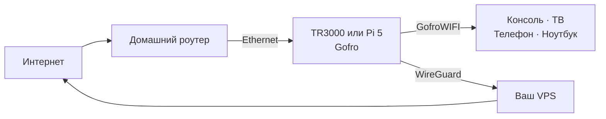

<p align="center">
  
</p>

<p align="center">
  <strong>Превратите отдельный роутер или Raspberry Pi 5 в Wi-Fi-сеть с VPN.</strong><br>
  Подключайте телевизор, консоль, телефон или ноутбук без VPN-приложений на каждом устройстве.
</p>

<p align="center">
  
  
  
  
</p>

## Отдельный Wi-Fi с VPN

**Gofro Router** работает на отдельном Cudy TR3000 или Raspberry Pi 5. Он
получает интернет от основного домашнего роутера по Ethernet и создаёт обычную
Wi-Fi-сеть для консоли, телевизора или телефона. Маршрутизация через VPS
выполняется на устройстве Gofro.

Основная домашняя сеть не меняется. Если Gofro выключен, остальные домашние
устройства продолжают работать через основной роутер.

## Платформа

Поддерживаются Cudy TR3000-256MB V1.0 с официальным OpenWrt 25.12 и Raspberry
Pi 5 с 64-битной Raspberry Pi OS Lite Trixie. Репозиторий собирает общие
статические бинарники и отдельные платформенные архивы; собственной ОС и образов
прошивки здесь нет.

Установщик добавляет:

- `gofro-agent` - локальный контроллер и web-панель;
- `gofro-relay` - обфусцированный UDP-транспорт для WireGuard;
- сервисы `procd`/systemd и сетевую конфигурацию платформы;
- GeoSite/GeoIP данные для раздельной маршрутизации.

Rust workspace разделён по runtime-ролям:

- `gofro-agent` управляет API, FakeDNS и маршрутизацией;
- `gofro-server` добавляет и удаляет WireGuard peers на VPS;
- `wireguard-status` читает и разбирает `wg show ... dump`;
- `gofro-relay` передаёт WireGuard-пакеты между роутером и VPS.

## Установка

На свежем TR3000 с OpenWrt замените `RU` на двухбуквенный код страны:

```sh
tmp="$(mktemp)" && trap 'rm -f "$tmp"' EXIT && uclient-fetch -q -O "$tmp" https://github.com/gofronet/gofro-router/releases/latest/download/gofro-install && sh "$tmp" --install RU
```

На Raspberry Pi 5 с Raspberry Pi OS Lite Trixie и Ethernet uplink:

```sh
tmp="$(mktemp)" && trap 'rm -f "$tmp"' EXIT && curl -fsSL -o "$tmp" https://github.com/gofronet/gofro-router/releases/latest/download/gofro-install-raspios && sudo sh "$tmp" --install RU
```

После установки подключитесь к GofroWIFI и откройте
[wifi.gofro.net](http://wifi.gofro.net). Подробности:
[OpenWrt](deploy/openwrt/README.md), [Raspberry Pi OS](deploy/raspios/README.md).

## Схема сети



1. OpenWrt или Raspberry Pi OS получает uplink по Ethernet.
2. Gofro настраивает LAN `10.203.1.1/24` и отдельный Wi-Fi.
3. FakeDNS и nftables выбирают прямой маршрут, VPN или блокировку.
4. WireGuard передаёт VPN-трафик через ваш VPS.

## Управление

Панель Gofro доступна по адресу
[wifi.gofro.net](http://wifi.gofro.net). LuCI доступен по адресу
[10.203.1.1:81](http://10.203.1.1:81) только на OpenWrt.

В панели можно:

- переключаться между режимами **VPN** и **DIRECT**;
- добавлять и выбирать VPN-серверы;
- задавать правила GeoSite, GeoIP, доменов и подсетей;
- видеть состояние туннеля и подключённые Wi-Fi-устройства;
- менять имя и пароль доступных Wi-Fi сетей.

Если VPN пропадает, таблица маршрутизации остаётся fail-closed и не отправляет
помеченный VPN-трафик через обычный WAN.

## `gofro-relay`

WireGuard шифрует трафик, но его UDP-пакеты имеют узнаваемую структуру.
`gofro-relay` меняет внешнюю форму уже зашифрованных пакетов:

```text
WireGuard на Gofro Router
    -> локальный gofro-relay
    -> UDP-порт 8443 на VPS
    -> серверный gofro-relay
    -> WireGuard на VPS
```

Relay не расшифровывает пользовательский трафик и не заменяет безопасность
WireGuard. Это транспортная обфускация против базового распознавания протокола,
а не дополнительное шифрование или имитация HTTPS.

## Что понадобится

- Cudy TR3000-256MB V1.0 с OpenWrt 25.12 или Raspberry Pi 5 с 64-битной
  Raspberry Pi OS Lite Trixie;
- Ethernet-подключение к основному роутеру;
- VPS с публичным IPv4;

Для устройств с серийным кодом `2544` и новее нельзя использовать старый Cudy
intermediate image: их NAND требует поддержки `F50L1G41LC`.

## Обновления

Gofro автоматически проверяет GitHub каждые шесть часов. Для немедленной
проверки откройте в панели **Настройки → Система** и нажмите **Проверить
обновления**. Updater проверяет подписанный release-архив, атомарно переключает
версию и возвращает предыдущую при неудачном health check или прерванном
обновлении. Конфигурация в `/etc/gofro` и OpenWrt UCI не перезаписывается.

Процедура выпуска описана в [RELEASING.md](RELEASING.md).

Старые Raspberry Pi установки требуют новой установки.
