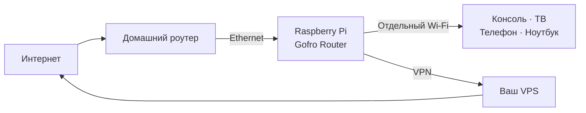

<p align="center">
  
</p>

<p align="center">
  <strong>Превратите Raspberry Pi в отдельный Wi-Fi-роутер с VPN.</strong><br>
  Подключайте телевизор, консоль, телефон или ноутбук — без установки VPN-приложений на каждое устройство.
</p>

<p align="center">
  
  
  
  
  
</p>

## Отдельный Wi-Fi с VPN

**Gofro Router** берёт интернет от домашнего роутера по Ethernet и создаёт свою Wi-Fi-сеть. Всё, что подключено к этой сети, может выходить в интернет через защищённый туннель и ваш VPS.

Устройству не нужно поддерживать VPN-приложения или уметь импортировать конфигурацию. Для телевизора, игровой консоли или телефона это выглядит как обычный Wi-Fi.

## С чего всё началось

Идея проекта появилась из-за проблемы у моего друга: некоторые игры и сетевые сервисы PlayStation перестали нормально работать в России. Сама консоль не поддерживает VPN: она не умеет поднимать туннель или подключаться к нему как VPN-клиент.

Друг не программист и не занимается сетями. Вариант с перепрошивкой и ручной настройкой домашнего роутера для него был слишком сложным, к тому же его модель не поддерживала OpenWrt.

Поэтому VPN должен работать на уровне сети, незаметно для PlayStation. Так появилась идея отдельного небольшого устройства на Raspberry Pi. Оно подключается к домашнему роутеру, поднимает свою Wi-Fi-сеть и отправляет трафик через VPS. Консоль видит обычный Wi-Fi и ничего не знает о туннеле — вся маршрутизация происходит внутри устройства.

Такая сеть подходит и для других устройств, на которых неудобно или невозможно настраивать VPN: телевизоров, ТВ-приставок, телефонов и ноутбуков.

## Почему не установить VPN на обычный роутер

Готовых решений для OpenWrt и других прошивок действительно много. Они хорошо подходят тем, у кого совместимый роутер и есть желание разбираться в его прошивке, маршрутах и VPN-конфигурации.

Но домашний роутер может не поддерживать нужную прошивку, а ошибка при настройке способна оставить без интернета весь дом. Покупать новый роутер и учиться его администрировать ради одного устройства тоже не всегда разумно.

Gofro Router работает отдельно и не требует менять существующую домашнюю сеть. Raspberry Pi получает интернет по Ethernet, а всё управление VPN, Wi-Fi и обновлениями остаётся внутри неё.

Цель проекта — свести использование к простому сценарию: принести устройство домой, подключить питание и Ethernet к домашнему роутеру, а затем выбрать появившуюся Wi-Fi-сеть. Без прошивки роутера, командной строки и ручной настройки VPN.

Сейчас репозиторий — техническая основа такого устройства, и первоначальное развёртывание ещё требует подготовки. В будущем на его базе может появиться готовый продукт с заранее настроенным сервером и собственным VPN-сервисом.

## Raspberry Pi 5 — платформа для прототипа

Текущая версия работает на Raspberry Pi 5, но это не выбор железа для конечного устройства. Pi 5 удобна для разработки и позволяет быстро проверить саму идею: насколько такая отдельная сеть понятна в подключении, удобна в управлении и полезна в повседневном использовании.

Для готового продукта Raspberry Pi 5 слишком дорогая — она может стоить как несколько обычных роутеров. Если идея себя оправдает, проект будет перенесён на более простое, компактное и бюджетное железо.

Цель — сделать небольшое устройство, которое стоит дешевле отдельного полноценного роутера, не требует его перепрошивки и решает одну конкретную задачу: добавляет к домашней сети простой Wi-Fi с VPN.

## Для чего его можно использовать

| Сценарий | Что даёт Gofro Router |
| --- | --- |
| Игровая консоль | Подключение через VPN без VPN-клиента на PlayStation, Xbox или другом устройстве |
| Телевизор | Отдельный Wi-Fi для YouTube, стриминговых сервисов и приложений Smart TV |
| ТВ-приставка | Единый VPN-маршрут без настройки каждого приложения |
| Телефон или планшет | Быстрое подключение к домашнему VPN как к обычной Wi-Fi-сети |
| Ноутбук | Возможность переключиться на VPN-сеть без изменения системных настроек |
| Несколько устройств | Один туннель и одна точка управления вместо отдельных VPN-клиентов |

Это может быть игровая сеть, Wi-Fi для телевизора или просто отдельная домашняя сеть, весь трафик которой выходит через сервер в выбранной вами стране.

## Как это выглядит дома



1. Raspberry Pi получает интернет от домашнего роутера по кабелю.
2. Pi создаёт отдельную Wi-Fi-сеть, например `GofroNET WiFi`.
3. Подключённые устройства выходят в интернет через ваш VPS.
4. При необходимости VPN можно отключить, и сеть перейдёт в прямой режим.

Основной домашний Wi-Fi продолжает работать как раньше. Gofro Router не обязан заменять существующий роутер — он добавляет рядом отдельную сеть с собственным маршрутом.

## Управление без командной строки

После установки роутер управляется через локальную web-панель по адресу [gofrowifi.net](http://gofrowifi.net).

В панели можно:

- переключаться между режимами **VPN** и **DIRECT**;
- видеть, работает ли туннель и через какой сервер идёт трафик;
- добавлять и выбирать VPN-серверы;
- смотреть подключённые устройства и использование трафика;
- следить за температурой, CPU, памятью и временем работы Raspberry Pi;
- менять название и пароль Wi-Fi-сети;
- проверять и устанавливать обновления.

## Что происходит с трафиком

В режиме **VPN** данные идут от устройства к Raspberry Pi, затем через зашифрованный WireGuard-туннель на ваш VPS и оттуда в интернет. Внешние сервисы видят IP-адрес VPS.

В режиме **DIRECT** Raspberry Pi отправляет трафик через обычный домашний интернет без VPN. Переключение выполняется из панели.

Если VPN-туннель неожиданно пропадёт, kill switch не позволит трафику незаметно уйти напрямую через домашний канал.

## Зачем нужен `wg-relay`

WireGuard шифрует трафик, но его UDP-пакеты всё равно имеют узнаваемую структуру. Сетевое оборудование провайдера может определить протокол по сигнатуре и ограничить или полностью заблокировать соединение, не расшифровывая его содержимое.

`wg-relay` был сделан, чтобы убрать эту узнаваемую внешнюю форму, не отказываясь от самого WireGuard. Он работает между WireGuard и интернетом с обеих сторон туннеля:

```text
WireGuard на Pi
    → локальный wg-relay
    → UDP-порт 8443 на VPS
    → серверный wg-relay
    → WireGuard на VPS
```

На Raspberry Pi WireGuard отправляет пакеты не напрямую на VPS, а локальному `wg-relay`. Relay помещает уже зашифрованный пакет в собственную оболочку, меняет его вид и добавляет случайное количество служебных байтов. На VPS второй экземпляр `wg-relay` снимает оболочку и передаёт исходный пакет локальному WireGuard. Ответ проходит тот же путь в обратную сторону.

Relay не видит исходный интернет-трафик, не расшифровывает его и не заменяет защиту WireGuard. Ключи, шифрование, проверка целостности и аутентификация по-прежнему остаются между WireGuard на Raspberry Pi и WireGuard на VPS.

Такое разделение позволяет:

- сохранить быстрый и хорошо проверенный WireGuard для самого VPN;
- скрыть его стандартную сигнатуру от простой фильтрации по протоколу;
- оставить снаружи один UDP-порт relay вместо прямого подключения к WireGuard;
- обслуживать до 256 экземпляров Gofro Router через один relay на VPS;
- обойтись небольшим сервисом без тяжёлого прокси-сервера и отдельной системы ключей.

Это именно обфускация транспорта, а не дополнительное шифрование и не имитация HTTPS. Она рассчитана на защиту от базового распознавания WireGuard, но не гарантирует обход любого продвинутого DPI. Такой подход выбран намеренно: сложную и критичную часть — безопасность VPN — выполняет WireGuard, а `wg-relay` решает только одну узкую задачу доставки его пакетов в другом внешнем формате.

## Почему свой VPS

Gofro Router не является VPN-провайдером и не отправляет трафик в сторонний облачный сервис проекта. Вы сами выбираете VPS, его страну и владельца.

Такой подход даёт:

- собственный внешний IP-адрес;
- контроль над сервером и VPN-конфигурацией;
- один маршрут для всех подключённых устройств;
- отсутствие отдельной подписки на VPN для телевизора, консоли и телефона.

Стоимость и правила использования VPS зависят от выбранного хостинга.

## Что понадобится

- Raspberry Pi 5 с 64-битной Raspberry Pi OS;
- Ethernet-подключение к домашнему роутеру;
- VPS с публичным IPv4;
- карта памяти и питание для Raspberry Pi;
- немного времени на первоначальную установку.

После первоначальной настройки повседневное управление выполняется через web-панель.

## Надёжность и обновления

Raspberry Pi автоматически проверяет подписанные стабильные релизы. Обновление проверяет подпись и контрольную сумму, переключает все компоненты атомарно и откатывается на предыдущую версию, если сервисы или VPN не смогли восстановиться.

Панель работает локально и не требует внешнего аккаунта. Она рассчитана на доверенную домашнюю сеть: отдельной авторизации в web-интерфейсе пока нет.

## Что внутри

Проект написан на Rust, web-панель — на Svelte. Для туннеля используется WireGuard, для маршрутизации и защиты от утечек — штатные сетевые возможности Linux.

Основные части проекта:

- `pi-agent` управляет Wi-Fi, маршрутами и локальной панелью;
- `wg-relay` передаёт зашифрованный трафик между Raspberry Pi и VPS;
- `maxos-server` настраивает серверную часть WireGuard и NAT;
- `gofro-updater` безопасно устанавливает подписанные обновления.

Техническая процедура выпуска и восстановления описана в [RELEASING.md](RELEASING.md).
